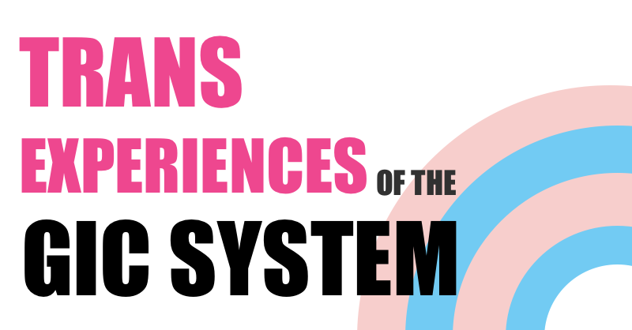

# Trans people and the GICs

A site to document trans peoples experiences with the UK's GIC system.
## How to Use?

1. Install dependencies by running `npm i`
2. Add experiences (in markdown) in the `posts` folder.
3. Run a copy of the project locally using `npm run serve` to see your changes locally.
4. Run `npm run build` which will build the website in the `_site` folder which you can deploy.

